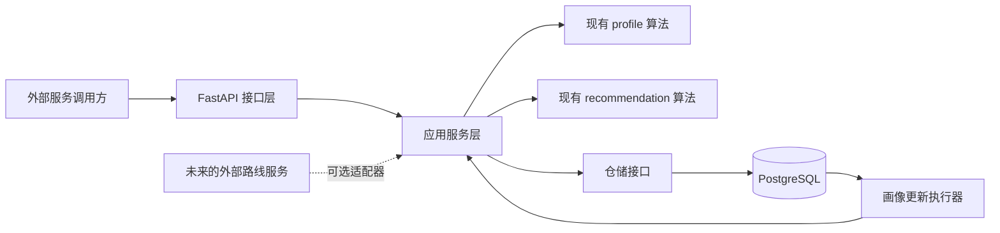

# 个性化推荐项目 API 服务化实现说明书

> 状态：已完成架构复审，作为后续实现、测试和验收的唯一执行基线。
>
> 适用范围：在不改变现有 FAVOUR 画像算法、加权路线排序和 JND 精排数学语义的前提下，为项目增加用户管理、持久化、对外 API、可靠画像更新和部署能力。

## 1. 文档目的

这份文档不是概念草案，而是后续编码时逐项执行的实现说明书。实现过程中如果发现必须偏离本文的情况，应先记录原因、影响范围和替代方案，再修改设计；不能在代码里悄悄改变数据语义或算法语义。

完成实现后，应能形成以下闭环：

1. 创建用户并生成初始画像。
2. 使用该用户当前画像对外部候选路线进行加权排序或 JND 精排。
3. 保存排序时使用的画像版本、候选路线和实际展示集合。
4. 保存用户确认的真实路线选择。
5. 将选择转换成一条成对偏好证据。
6. 根据完整有效历史生成新画像版本。
7. 下一次推荐使用最新成功生成的画像。
8. 在重复请求、并发反馈、计算失败和服务重启时仍保持数据一致。

### 1.1 第一版明确范围

包括：默认或命名预设初始化、画像查询、候选路线排序、JND 精排、真实选择反馈、画像重建、鉴权、持久化、任务恢复和用户数据删除。

暂不包括：

- 根据起点和终点搜索交通网络。
- 初始问卷式路线二选一接口；以后可复用相同事件和证据管道扩展。
- 外部群体 MPP 或 `group_histories` API。
- 任意手填画像系数、协方差或百分比。
- 永久冻结画像。命名预设是可学习的初始化，不是冻结状态。
- 多币种换算、汇率服务和位置轨迹存储。

## 2. 已核准的现有代码事实

### 2.1 画像学习器是无状态的

`PairwisePreferenceWeightLearner.fit()` 每次调用都重新确定初始先验，然后按传入顺序逐条处理 `comparisons`。对象本身不保存用户历史，也没有“直接以上一版后验继续计算”的公共接口。

服务层更新画像时必须读取用户的完整有效证据，并按稳定顺序重新调用：

```python
learner.fit(
    all_effective_comparisons_in_sequence_order,
    preference_preset=user.preset_name,
)
```

API 服务不得向外部调用方开放 `group_histories`，服务实现调用时始终不传该参数。现有研究代码可以保留，但不属于公共服务契约。

### 2.2 空历史会得到有效初始画像

当 `comparisons` 为空时，推断器直接返回初始先验并标记 `converged=True`。

两种初始化必须明确区分：

- `default`：先验均值为 0、协方差为单位阵；对外权重为四项各 0.25。
- `preset=balanced`：对外权重同样为四项各 0.25，但系数均值为负值，和 `default` 的后续学习强度不同。
- 其他命名预设：`time_priority`、`cost_priority`、`low_walking`、`low_transfers`。

因此不能因为 `default` 和 `balanced` 初始百分比相同，就把它们合并成一种数据状态。

### 2.3 学习顺序会影响结果

当前实现把每题后验作为下一题先验，属于顺序增量更新。数据库必须给每个用户的偏好事件分配单调递增的 `sequence_number`，重算时只能按该编号升序处理，不能依赖可能相同或由客户端伪造的时间戳。

### 2.4 路线排序器不负责路线搜索

`PersonalizedRouteRanker.rank()` 和 `JndEnhancedRouteRanker.rank()` 只处理上游传入的候选路线。API 第一版接收候选路线属性，不接收起点终点后自行搜索交通网络。

如果以后接入地图或多模式路径规划服务，应增加 `RouteProvider` 适配器，不能把网络请求写进现有算法模块。

### 2.5 路线学习与排序使用同一套固定尺度

当前固定尺度为：

- 时间：180 分钟
- 费用：100 个统一费用单位
- 步行：3000 米
- 换乘：4 次

这些尺度影响画像学习和路线排序，必须被标记为一个不可随意覆盖的代码版本。修改尺度时要发布新的 `normalization_version`，不能直接覆盖旧常量后继续解释旧画像。

### 2.6 JND 没有业务默认阈值

JND 模式要求调用方明确提供四个非负比例阈值，并满足：

- `shortlist_size` 是正整数。
- `top_k` 是正整数。
- `top_k <= shortlist_size`。

API 不得擅自创造默认 JND 阈值。所有候选被硬约束过滤时是一个合法的空推荐结果，而不是服务器错误。

## 3. 复审后的总体结论

采用“模块化单体代码库 + PostgreSQL + API 进程 + 同代码库画像任务执行器”的结构。

第一版不拆微服务，原因是：

- 用户选择、画像版本和推荐会话之间需要强一致关联。
- 当前算法规模小，拆服务不会带来明确性能收益。
- 单仓库仍可通过接口和目录边界保持模块独立。
- 后续画像任务可以单独启动进程，但无需立即拆仓库或复制算法。

核心数据原则：

```text
不可变的选择事实 = 原始账本
成对偏好证据     = 按策略生成的中间数据
画像版本         = 可重建的计算快照
最新可用画像     = 最近一次成功快照
```

不能只保存四个百分比，也不能把画像当成唯一事实。

## 4. 逻辑架构



### 4.1 依赖方向

依赖只能从外向内：

```text
api -> application -> profile / recommendation
                    -> repository protocols
infrastructure -> repository protocols
```

必须遵守：

- `profile` 和 `recommendation` 不得导入 FastAPI、SQLAlchemy、数据库模型或环境配置。
- API 请求对象不得直接传入领域算法。
- SQLAlchemy ORM 对象不得作为 API 响应。
- 应用服务负责把 API DTO、数据库记录与现有 dataclass 相互转换。

### 4.2 目标目录

```text
src/
  profile/                         # 现有算法，保持数学语义
  recommendation/                  # 现有排序，保持数学语义
  application/
    ports.py                       # 仓储、时钟、任务接口
    versions.py                    # 算法与证据策略版本常量
    evidence_policy.py             # 真实选择 -> PairwisePreference
    user_service.py
    recommendation_service.py
    feedback_service.py
    profile_rebuild_service.py
  api/
    main.py
    dependencies.py
    errors.py
    schemas/
      common.py
      users.py
      recommendations.py
      feedback.py
      profiles.py
    routers/
      users.py
      recommendations.py
      profile_jobs.py
      health.py
  infrastructure/
    db/
      base.py
      session.py
      models.py
      repositories.py
    security/
      api_keys.py
  worker/
    main.py

migrations/
alembic.ini
Dockerfile
compose.yaml
.env.example
```

## 5. 固定版本标识

版本标识必须是代码常量，不能仅由环境变量随意伪造：

```text
PROFILE_ALGORITHM_VERSION = "favour-laplace-v1"
NORMALIZATION_VERSION = "fixed-scales-v1"
EVIDENCE_POLICY_VERSION = "chosen-vs-best-unchosen-v1"
WEIGHTED_RANKING_VERSION = "weighted-cost-v1"
JND_RANKING_VERSION = "corrected-jnd-lexicographic-v1"
```

每个画像版本保存前三项；每个推荐会话保存画像版本、归一化版本和对应排序版本。

费用单位是模型语义的一部分。生产环境必须设置唯一的 `MODEL_COST_UNIT`；同一画像历史中的路线费用必须使用该单位。第一版不在服务内做汇率转换，单位不一致时拒绝请求。

## 6. PostgreSQL 数据模型

所有主键使用 UUID，时间使用 UTC `TIMESTAMPTZ`。算法直接使用的浮点值使用 `DOUBLE PRECISION`。数据库状态枚举使用 `VARCHAR + CHECK`，避免 PostgreSQL 原生枚举后续扩展困难。

### 6.1 `api_clients`

外部调用方及数据隔离边界。

| 字段 | 说明 |
|---|---|
| `id` | UUID 主键 |
| `name` | 调用方名称 |
| `key_prefix` | 用于定位密钥，唯一 |
| `key_digest` | 高熵 API Key 的加盐摘要，不保存明文 |
| `scopes` | JSONB 权限列表 |
| `status` | `active/revoked` |
| `created_at`、`last_used_at` | 审计时间 |

所有用户数据查询必须同时带 `api_client_id`。访问其他调用方资源时返回 404，避免泄露资源是否存在。

### 6.2 `users`

| 字段 | 说明 |
|---|---|
| `id` | UUID 主键 |
| `api_client_id` | 数据所属调用方 |
| `external_user_id` | 外部系统中的匿名用户编号 |
| `initialization_mode` | `default/preset`，创建后不可变 |
| `preset_name` | 仅 `preset` 模式非空 |
| `event_sequence` | 已接收偏好事件的最大顺序号，初始为 0 |
| `created_at`、`updated_at` | 时间 |

约束：

- 唯一键：`(api_client_id, external_user_id)`。
- `default` 必须没有 `preset_name`。
- `preset` 必须使用当前五个合法命名预设之一。
- 第一版所有用户都是可学习画像；不增加含义模糊的 `fixed` 模式。

### 6.3 `profile_versions`

只保存成功生成的不可变画像快照，不覆盖旧版本。

核心字段：

| 字段 | 说明 |
|---|---|
| `id`、`user_id` | 标识与归属 |
| `version` | 用户内从 1 开始递增 |
| `built_through_sequence` | 计算时覆盖到的事件序号 |
| `evidence_count` | 本版实际采用的成对证据数 |
| `converged` | 当前算法收敛标记 |
| `coefficient_time/cost/walking/transfers` | 后验均值，即实际效用系数 |
| `weight_time/cost/walking/transfers` | 归一化后的 0 到 1 权重 |
| `covariance` | JSONB 4×4 矩阵 |
| `lower_bounds`、`upper_bounds` | JSONB 四维边界 |
| `algorithm_version` | 画像算法版本 |
| `normalization_version` | 特征尺度版本 |
| `evidence_policy_version` | 成对证据生成策略版本 |
| `model_cost_unit` | 费用模型单位 |
| `created_at` | 生成时间 |

约束：

- 唯一键：`(user_id, version)`。
- 同一计算版本防重键：`(user_id, built_through_sequence, algorithm_version, normalization_version, evidence_policy_version)`。
- 四个权重均在 `[0, 1]`，应用层校验总和约等于 1。
- 系数必须在当前领域模型允许的边界内。
- 协方差的对称和严格正定由现有 `GaussianPreferenceModel` 再次校验。

不保存每一版完整的 `choice_probabilities`，因为每版都保存全部历史概率会形成平方级存储增长。需要诊断时可由原始事件和版本化算法重新计算。

“当前画像”定义为该用户 `version` 最大的成功记录，不在 `users` 中增加循环外键。判断是否更新中：

```text
latest_profile.built_through_sequence < users.event_sequence
```

### 6.4 `recommendation_sessions`

保存一次排序计算的输入配置与结果摘要。

字段至少包括：

- `id`、`api_client_id`、`user_id`。
- `profile_version_id`：本次实际使用的画像。
- `ranking_mode`：`weighted/jnd`。
- `ranking_version`、`normalization_version`、`model_cost_unit`。
- `constraints` JSONB。
- `jnd_thresholds` JSONB，可空。
- `shortlist_size`、`top_k`。
- `candidate_count`、`feasible_count`。
- `created_at`。

JND 模式必须保存完整阈值；加权模式的 JND 字段必须为空。

### 6.5 `route_snapshots`

保存推荐时真正参与算法的路线快照：

- `id`、`session_id`、`external_route_id`。
- `total_time_minutes`。
- `total_cost` 与 `model_cost_unit`。
- `walking_distance_meters`。
- `transfer_count`。
- `is_feasible`、`constraint_violations`。
- `weighted_rank`、`final_rank`。
- `personalized_cost`。
- `normalized_attributes`、`weighted_contributions`。
- `advantage_dimensions`、`jnd_decisive_dimension`。

唯一键：`(session_id, external_route_id)`。

第一版默认不保存起点、终点、轨迹和完整地图载荷，因为它们不是算法重算所需数据，并可能暴露敏感位置。若业务以后必须保存，应单独设计加密与留存期限。

### 6.6 `choice_events`

偏好事件采用追加写入，不直接删除或改写历史事实。

字段包括：

- `id`、`user_id`、`sequence_number`。
- `event_type`：第一版支持 `choice_confirmed`、`choice_retracted`。
- `session_id`。
- `chosen_route_snapshot_id`。
- `target_event_id`：撤销事件引用原确认事件。
- `source`：第一版固定为 `confirmed_route_choice`，表示用户明确选择了路线，不要求已经完成整次出行。
- `occurred_at`：客户端报告时间，仅用于展示。
- `created_at`：服务端接收时间。

约束：

- 唯一键：`(user_id, sequence_number)`。
- 确认事件必须有会话和选中路线，且路线属于该会话。
- 撤销事件必须引用同一用户的既有确认事件。
- 同一确认事件只能被有效撤销一次。
- 同一推荐会话同一时刻最多存在一个未撤销的确认选择；需要更正时先追加撤销，再追加新确认。
- 学习顺序只使用 `sequence_number`。

### 6.7 `choice_event_presented_routes`

保存用户当时实际看到的路线集合与展示顺序：

- `choice_event_id`。
- `route_snapshot_id`。
- `display_position`。

确认选择 API 必须提交 `presented_route_ids`。所有路线必须来自同一个推荐会话，必须是可行并已返回的路线，选中路线必须包含在其中。

### 6.8 `profile_evidences`

保存按某一策略从事实事件生成的成对学习证据：

- `user_id`、`source_choice_event_id`。
- `chosen_route_snapshot_id`、`rejected_route_snapshot_id`。
- `event_sequence_number`。
- `evidence_policy_version`。
- `created_at`。

唯一键：`(source_choice_event_id, evidence_policy_version)`。

它属于可重建中间数据。发生策略升级时，不覆盖旧策略证据，而是生成新策略版本。

### 6.9 `profile_update_jobs`

选择事实和画像计算不能使用同一个事务，否则数值优化失败会导致真实选择也被回滚。任务表用于保证“事实已保存，画像可重试”。

字段包括：

- `id`、`user_id`。
- `requested_through_sequence`。
- `status`：`pending/running/succeeded/failed/superseded`。
- `attempt_count`、`available_at`、`locked_at`。
- `last_error_code`、截断后的 `last_error_message`。
- `created_at`、`updated_at`。

唯一防重键包含用户、目标序号和三个模型版本。

任务执行器可以先与 API 同进程同步调用；生产环境可以用同一代码库启动独立 worker。无论哪种模式，事件和任务必须在同一数据库事务中落库。

### 6.10 `idempotency_records`

所有会产生写入的 POST 请求要求 `Idempotency-Key`。

保存：调用方、操作名、幂等键、请求体哈希、响应状态、响应体、资源 ID、创建时间。

规则：

- 同一调用方、同一操作、同一键和同一请求体：返回第一次结果。
- 同一键但请求体不同：返回 409。
- 幂等记录与业务写入在同一事务完成。
- 与用户资源有关的幂等记录必须关联 `user_id`，用户删除时一并清除，避免响应副本残留个人画像。

## 7. 成对证据生成策略

策略名：`chosen-vs-best-unchosen-v1`。

对每个仍然有效的 `choice_confirmed` 事件：

1. 读取当时实际展示的路线集合。
2. 排除选中路线。
3. 排除与选中路线四项属性完全相同的路线。
4. 按该会话的 `final_rank` 升序选取排名最高的未选路线。
5. 生成 `PairwisePreference(chosen, rejected)`。
6. 如果不存在可比较路线，本次事实仍保留，但不生成学习证据。

选择该策略的原因：

- 一次真实出行只增加一条证据，避免展示路线数量不同导致学习权重失衡。
- 用户未选系统第一名时，第一名是最有信息量的反例。
- 用户选择第一名时，下一名是自然对照。
- 完整展示集合已经保存，以后可以发布新策略并重建。

所有有效证据按原事件的 `sequence_number` 升序传给当前学习器。

## 8. 核心业务流程

### 8.1 创建用户

1. 验证 API Client、外部用户 ID 和初始化方式。
2. 检查幂等键与 `(api_client_id, external_user_id)` 唯一性。
3. 调用 `fit(())` 生成初始画像。
4. 在一个事务中写入用户、`profile_versions.version=1` 和幂等记录。
5. 返回用户与初始画像。

预设只决定初始先验，后续确认选择仍然参与学习。第一版不提供直接写入任意系数或任意百分比的公共接口。

### 8.2 创建推荐会话

1. 读取所属用户与最新成功画像。
2. 验证候选非空、路线 ID 唯一、属性非负、费用单位一致。
3. 将数据库画像转换为领域 `PreferenceLearningResult` 或四维权重。
4. `weighted` 模式调用 `PersonalizedRouteRanker.rank()`。
5. `jnd` 模式验证完整阈值和数量关系后调用 `JndEnhancedRouteRanker.rank()`。
6. 在一个事务中保存会话、全部候选快照、过滤原因和排序结果。
7. 返回 `session_id`、`profile_version_used`、当前画像状态和排序结果。

所有候选被过滤时返回成功响应：`ranked_routes=[]`、`feasible_count=0`。空候选输入才是 422。

### 8.3 提交真实选择

事务 A：

1. 校验会话、选中路线和展示路线都属于当前 API Client 与用户。
2. 校验展示集合非空、无重复、包含选中路线且只包含可行返回路线。
3. 锁定用户行，递增 `users.event_sequence`。
4. 写入确认事件和展示集合。
5. 写入 `profile_update_jobs`。
6. 写入幂等记录并提交。

事务 A 成功后，真实事实已永久保存。接口统一返回 202、任务 ID 和状态查询地址，保证幂等响应稳定。`inline` 模式可以在返回前尝试执行任务，`worker` 模式由独立进程执行；无论执行是否立即完成，客户端都通过任务接口或当前画像接口确认最终结果。数值计算失败时保留旧画像，事件不丢失。

### 8.4 画像任务执行

1. 领取任务；并发 worker 使用行锁避免重复领取。
2. 读取目标用户到当前最新 `event_sequence` 的完整事件流。
3. 折叠确认和撤销事件，得到有效选择。
4. 按证据策略生成或复用 `profile_evidences`。
5. 按 `event_sequence_number` 升序构造 `PairwisePreference`。
6. 默认用户调用 `fit(comparisons)`；预设用户调用 `fit(comparisons, preference_preset=...)`。
7. 不传 `group_histories`。
8. 在新事务中锁定用户，检查计算目标是否仍是最新事件序号。
9. 若出现更新事件，当前任务标记 `superseded` 并为最新序号保留或创建任务。
10. 若仍是最新，插入下一版 `profile_versions` 并标记任务成功。

worker 领取任务使用 `SELECT ... FOR UPDATE SKIP LOCKED`。失败任务按指数退避重试，达到 `PROFILE_JOB_MAX_ATTEMPTS` 后保留为 `failed`；后续新事件或管理重建可以创建新任务。

### 8.5 下一次推荐

默认使用最新成功画像，不使用正在计算或失败的中间结果。

响应同时返回：

- `profile_status=ready/updating/failed`。
- `profile_version_used`。
- `profile_built_through_sequence`。
- `user_event_sequence`。

这样外部调用方可以知道推荐是否使用了刚提交反馈后的最新画像。

### 8.6 撤销错误选择

撤销不是修改旧事件，而是追加一个 `choice_retracted` 事件，并生成新的画像任务。重算时，被撤销的确认事件不进入有效证据集合。

第一版撤销接口要求管理权限，避免普通调用方误删训练证据。

## 9. HTTP API 契约

统一前缀：`/v1`。JSON 字段使用 `snake_case`，时间使用 ISO 8601 UTC。

### 9.1 创建用户

`POST /v1/users`

```json
{
  "external_user_id": "traveller-001",
  "initial_profile": {
    "mode": "preset",
    "preset": "time_priority"
  }
}
```

返回 `201`，包含：

- 用户 UUID。
- 初始化方式。
- `profile_version=1`。
- 四维系数。
- 四维权重和由权重计算出的百分比。
- 协方差、标准差、证据数量、收敛状态和版本标识。

### 9.2 查询当前画像

`GET /v1/users/{user_id}/profile`

返回最新成功画像和画像状态。权重使用 0 到 1 小数；百分比只在响应序列化时计算，不单独作为数据库事实。

### 9.3 查询画像历史

`GET /v1/users/{user_id}/profile-versions?limit=50&cursor=...`

必须使用游标分页，按版本倒序。

### 9.4 创建推荐会话

`POST /v1/recommendation-sessions`

```json
{
  "user_id": "UUID",
  "ranking_mode": "jnd",
  "routes": [
    {
      "route_id": "route-a",
      "total_time_minutes": 42.0,
      "total_cost": 18.0,
      "model_cost_unit": "configured-unit",
      "walking_distance_meters": 620.0,
      "transfer_count": 1
    }
  ],
  "constraints": {
    "max_total_time_minutes": 120.0,
    "max_total_cost": 100.0,
    "max_walking_distance_meters": 3000.0,
    "max_transfer_count": 4
  },
  "jnd": {
    "shortlist_size": 5,
    "top_k": 3,
    "thresholds": {
      "time_ratio": 0.1,
      "cost_ratio": 0.1,
      "walking_distance_ratio": 0.1,
      "transfers_ratio": 0.1
    }
  }
}
```

JND 数值只是请求格式示例，不代表项目默认阈值。

响应保存并返回：

- 会话 ID。
- 使用的画像版本。
- 候选数、可行数。
- 被过滤路线及违反的维度。
- 排序路线、个性化代价、各维贡献。
- JND 模式下的指标优先级、决定维度和必要比较信息。

### 9.5 提交确认选择

`POST /v1/recommendation-sessions/{session_id}/choices`

```json
{
  "chosen_route_id": "route-b",
  "presented_route_ids": ["route-a", "route-b", "route-c"],
  "source": "confirmed_route_choice",
  "occurred_at": "2026-08-25T12:00:00Z"
}
```

成功提交统一返回：

- `202`：选择已保存，并返回稳定的任务 ID 与状态查询地址。

其他可能返回：

- `409`：会话状态冲突、幂等键复用但请求体不同。
- `422`：路线未展示、属性无效或其他领域验证错误。

任务结果必须明确 `learning_applied`。不存在任何可比较的未选路线时返回 `false`，画像证据数量不增加。

### 9.6 查询画像任务

`GET /v1/profile-update-jobs/{job_id}`

返回任务状态、目标事件序号、尝试次数和可公开错误码；不返回堆栈或数据库信息。

### 9.7 撤销选择

`POST /v1/choice-events/{event_id}/retractions`

仅管理 scope 可用，追加撤销事件并创建重算任务。

### 9.8 删除用户数据

`DELETE /v1/users/{user_id}`

要求专用删除 scope。事务中级联删除用户画像、选择、推荐快照和任务，返回 204。日志中不得保留路线与画像正文。

### 9.9 健康检查

- `GET /health/live`：只表示进程存活。
- `GET /health/ready`：检查数据库连接和迁移版本。

## 10. 错误响应

统一格式：

```json
{
  "error": {
    "code": "ROUTE_NOT_PRESENTED",
    "message": "选中路线不在本次展示集合中",
    "details": {},
    "request_id": "UUID"
  }
}
```

映射原则：

- Pydantic 请求结构错误：422。
- `ProfileValidationError`、`RecommendationValidationError`：422。
- 资源不存在或跨调用方访问：404。
- 状态、并发、幂等冲突：409。
- 未认证：401；权限不足：403。
- 数据库暂时不可用：503。
- `ProfileNumericalError`：选择事实仍保存，画像任务进入重试或失败状态；选择接口返回 202 和任务 ID，不把内部数值细节暴露给客户端。

## 11. 事务、并发与幂等要求

### 11.1 一个请求一个数据库 Session

SQLAlchemy `Session` 生命周期由 API 依赖管理：请求开始创建，结束提交或回滚，最后关闭。不同线程、请求和任务不得共享同一个 Session。

### 11.2 同一用户的事件序号串行分配

写入确认或撤销事件时使用 `SELECT ... FOR UPDATE` 锁定用户行，读取并递增 `event_sequence`。锁只影响同一用户的并发写入。

### 11.3 事实与画像分离提交

选择事实和画像任务同事务；画像计算在事务外执行；成功画像在新事务提交。禁止为了追求一次响应完成而把较长的数值计算放进保存事实的事务。

### 11.4 重复任务安全

相同用户、目标序号和模型版本的画像计算必须得到同一防重键。重复 worker 最多有一个成功插入画像版本，其余读取已有结果并结束。

### 11.5 事件顺序可复现

不以 `occurred_at`、数据库自然顺序或 UUID 排序。唯一合法学习顺序是用户内 `sequence_number`。

## 12. 安全与隐私

第一版采用服务到服务的 Bearer API Key：

- Key 必须是高熵随机值。
- 数据库只保存摘要和短前缀。
- 比较摘要使用恒定时间比较。
- Key 通过管理命令创建和撤销，不提供公开创建接口。
- 所有生产流量必须经过 HTTPS。
- scope 至少区分 `recommendations:write`、`profiles:read`、`profiles:admin`、`users:delete`。

用户表只保存外部匿名编号，不保存密码、姓名、手机号或邮箱。路线轨迹、起终点默认不入库。日志不得记录 API Key、完整请求体、画像协方差或用户路线集合。

如果以后改成面向终端用户直接登录，应接入成熟的 OAuth2/OIDC 身份提供方，不自行扩展当前 API Key 成密码系统。

## 13. 技术选型与依赖

### 13.1 运行依赖

- Python 3.12：保持当前项目要求。
- FastAPI：HTTP 路由、依赖注入、OpenAPI。
- Pydantic / pydantic-settings：请求响应与配置校验。
- SQLAlchemy 2.x：同步 ORM、事务和仓储实现。
- psycopg 3：PostgreSQL 驱动。
- Alembic：数据库迁移。
- Uvicorn：ASGI 服务器。

第一版选择同步 SQLAlchemy，而不是为了形式统一强行引入异步 ORM。画像优化本身是 CPU 计算，事务边界清晰比全链路 async 更重要。画像执行器使用独立进程后，API 与计算自然隔离。

### 13.2 开发依赖

- pytest：统一运行现有 unittest 和新增测试。
- httpx：FastAPI 接口测试。
- pytest-cov：覆盖率。
- 可选 Testcontainers 或 Compose PostgreSQL：数据库集成测试。

依赖使用 `uv` 管理，并提交更新后的 `uv.lock`。主版本范围写入 `pyproject.toml`，实际可复现版本由锁文件确定。

数据库集成测试必须以 PostgreSQL 为准，不能用 SQLite 代替，因为 JSONB、行锁、`SKIP LOCKED` 和并发行为并不等价。

### 13.3 暂不引入

- Redis：第一版没有明确缓存需要。
- Celery：先使用持久化数据库任务表和独立 worker，避免同时维护数据库事务与消息投递一致性。
- MongoDB：当前关系、唯一约束、事务和版本审计更适合 PostgreSQL。
- 微服务拆分：当前没有足够独立的负载或团队边界。

## 14. 配置项

`.env.example` 至少列出：

```text
APP_ENV=development
DATABASE_URL=postgresql+psycopg://...
MODEL_COST_UNIT=...
API_KEY_PEPPER=...
PROFILE_UPDATE_MODE=inline
PROFILE_JOB_MAX_ATTEMPTS=5
LOG_LEVEL=INFO
```

规则：

- 生产环境缺少 `DATABASE_URL`、`MODEL_COST_UNIT` 或安全密钥时启动失败。
- `PROFILE_UPDATE_MODE` 支持 `inline/worker`。
- 版本标识来自代码常量，不允许环境变量覆盖。

## 15. 部署形态

本地开发：

```text
FastAPI 进程 + PostgreSQL
PROFILE_UPDATE_MODE=inline
```

生产建议：

```text
API Gateway / HTTPS
        ↓
多个 API 进程
        ↓
PostgreSQL
        ↑
一个或多个 profile worker
```

worker 从 `profile_update_jobs` 领取任务。部署多个 worker 时使用数据库行锁和防重键保证安全。

数据库迁移由独立发布步骤执行，应用启动时只检查版本，不自动修改生产表结构。

## 16. 实现阶段

### 阶段 1：服务骨架

- 增加依赖、配置、FastAPI 工厂、健康检查和统一错误结构。
- 建立 application ports，保持领域模块无框架依赖。
- 建立 PostgreSQL、SQLAlchemy 与 Alembic 基础设施。

### 阶段 2：用户与画像保存

- 实现 API Client 鉴权。
- 实现用户创建。
- 使用空历史生成初始画像版本。
- 实现当前画像和画像历史查询。

### 阶段 3：推荐会话

- 实现候选路线 DTO 到 `RouteAttributes` 的转换。
- 实现加权和 JND 两种模式。
- 保存会话与完整路线快照。
- 返回可解释排序数据。

### 阶段 4：真实选择学习

- 保存追加式选择事件和实际展示集合。
- 实现证据策略与 `profile_evidences`。
- 实现任务表、inline executor 和独立 worker。
- 实现画像重算、版本防重和失败重试。

### 阶段 5：可靠性与交付

- 幂等、并发、跨调用方隔离和删除。
- Docker/Compose、迁移命令、启动说明。
- OpenAPI 校验、日志、测试与端到端验收。

每个阶段完成后先运行已有算法测试，确保服务化代码没有改变数学核心。

## 17. 测试与验收矩阵

### 17.1 必须保留的领域测试

- 当前 `tests/profile` 全部通过。
- 当前 `tests/recommendation` 全部通过。
- 默认和各命名预设输出不回归。
- JND 排序和解释过程不回归。

### 17.2 数据模型测试

- 外部用户 ID 在同一 API Client 下唯一。
- 不同 API Client 可以使用相同外部用户 ID。
- 非法初始化组合被数据库和应用层拒绝。
- 画像版本、防重键和事件序号唯一。
- 删除用户时相关个人数据完整清除。

### 17.3 API 契约测试

- 未认证返回 401。
- 跨调用方读取返回 404。
- 默认用户初始权重四项均为 0.25。
- `balanced` 与 `default` 权重相同但系数不同。
- JND 缺阈值或 `top_k > shortlist_size` 返回 422。
- 空候选返回 422。
- 全部候选被过滤返回成功空结果。
- 重复路线 ID 返回 422。
- 非统一费用单位返回 422。

### 17.4 学习闭环测试

完整端到端场景：

1. 创建默认或预设用户，得到画像 v1。
2. 创建推荐会话，断言保存了 `profile_version_used=v1`。
3. 提交真实选择和展示集合。
4. 断言事件只保存一次。
5. 断言生成一条正确的 chosen/rejected 证据。
6. 断言画像升级为 v2、`evidence_count=1`。
7. 再次推荐，断言使用 v2。

还要覆盖：

- 选择系统第一名时与下一名比较。
- 选择非第一名时与第一名比较。
- 属性完全相同路线会继续寻找下一个可比较路线。
- 没有可比较路线时事实保存但画像不增加证据。
- 撤销选择后重建并排除原证据。

### 17.5 幂等与并发测试

- 同一选择请求重复十次只产生一个确认事件和一个有效画像结果。
- 同一幂等键配不同请求体返回 409。
- 同一用户两个并发选择获得不同、连续的事件序号。
- 不同用户并发互不阻塞。
- 两个 worker 处理同一目标不会产生重复画像。
- 计算期间出现新事件时旧任务被 supersede，最终画像覆盖最新序号。

### 17.6 失败恢复测试

- 人工让画像计算抛出 `ProfileNumericalError`，确认选择事件仍在数据库。
- 任务失败时旧画像仍可用于推荐。
- 重试成功后生成新版画像。
- API 进程在事件提交后崩溃，worker 重启后仍能发现待处理任务。

### 17.7 数学与可重现性测试

- 同一初始化、同一有序证据和同一版本重复重算，四维系数、权重和协方差在浮点容差内一致。
- 权重非负且总和约等于 1。
- 系数位于边界内。
- 协方差对称且严格正定。
- 修改事件接收时间不改变顺序；修改 `sequence_number` 会按预期改变顺序。

### 17.8 质量门槛

- 所有已有测试与新增测试通过。
- Alembic 能从空库升级到最新版本。
- OpenAPI 文档可以生成并通过契约测试。
- 新增服务代码行覆盖率不低于 90%。
- 无明文 API Key、数据库密码或生产配置进入仓库。
- 格式化、静态检查和测试命令写入 README。

## 18. 完成定义

只有同时满足以下条件，才能称为“服务化实现完整”：

- 外部调用方能创建用户、查询画像、提交候选路线、获得排序、提交选择。
- 用户选择、展示集合、路线快照和画像版本真实持久化。
- 新选择最终生成新画像，下一次推荐可以验证使用了该版本。
- 重复请求不会重复学习。
- 并发请求不会覆盖或打乱用户事件顺序。
- 算法失败不会丢失真实选择。
- 默认、预设、加权排序、JND、硬约束和空结果全部有测试。
- API 有鉴权、版本、错误格式、健康检查和自动文档。
- 数据库有迁移、约束、备份和用户删除路径。
- 原有算法测试全部保持通过。

## 19. 实现时禁止的捷径

- 禁止只在内存字典中保存用户画像。
- 禁止只保存百分比而不保存系数、协方差和原始选择。
- 禁止使用上一版画像加完整历史再次学习，造成历史证据重复计算。
- 禁止依赖时间戳代替事件序号。
- 禁止用用户点击、查看详情等弱行为冒充确认选择。
- 禁止让外部 API 直接提交 `group_histories`、MPP、任意协方差或任意系数。
- 禁止在当前排序模块中实现路线搜索。
- 禁止为 JND 私自设定未经业务确认的默认阈值。
- 禁止在画像计算失败时回滚或丢弃已经确认的选择事实。
- 禁止把数据库 ORM 对象直接暴露为 API 响应。

## 20. 代码与技术依据

当前代码边界：

- `src/profile/learner.py:194`：画像统一入口及完整历史更新。
- `src/profile/inference.py:101`：空历史与 Laplace 推断行为。
- `src/profile/inference.py:131`：逐条顺序更新。
- `src/profile/models.py:82`：路线四维属性。
- `src/profile/models.py:194`：画像学习结果。
- `src/profile/normalization.py:18`：固定归一化尺度。
- `src/recommendation/ranking.py:71`：候选过滤与加权排序。
- `src/recommendation/jnd.py:146`：JND 精排入口。

技术依据：

- FastAPI 模块化与 OpenAPI：https://fastapi.tiangolo.com/tutorial/bigger-applications/
- FastAPI 安全方案：https://fastapi.tiangolo.com/tutorial/security/
- SQLAlchemy Session 与事务：https://docs.sqlalchemy.org/en/20/orm/session_basics.html
- PostgreSQL 行锁：https://www.postgresql.org/docs/17/explicit-locking.html
- PostgreSQL JSON 类型：https://www.postgresql.org/docs/16/datatype-json.html
- Alembic 迁移：https://alembic.sqlalchemy.org/en/latest/

---

后续实现应从“阶段 1”开始，按阶段提交代码和验证结果。不得先写完整 API 再补数据库约束，也不得先接入外部路线服务而跳过选择事实、画像版本和失败恢复。
