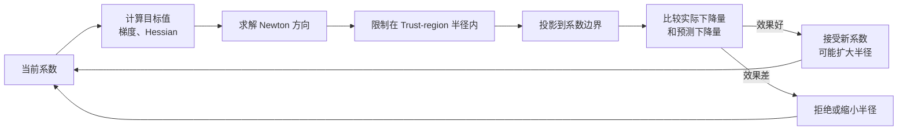

## profile 包中的 py 文件作用

| 文件 | 在系统中的定位 | 包含的主要逻辑 |
|---|---|---|
| [models.py](/Users/purelearning/code/ResearchProjects/PersonalizedRecommendations/src/profile/models.py:13) | 数据模型层 | 定义四个偏好维度、路线属性、路线选择、特征比较、Gaussian 先验/后验和最终结果 |
| [normalization.py](/Users/purelearning/code/ResearchProjects/PersonalizedRecommendations/src/profile/normalization.py:15) | 特征转换层 | 把分钟、费用、米数、换乘次数转换到统一尺度 |
| [optimization.py](/Users/purelearning/code/ResearchProjects/PersonalizedRecommendations/src/profile/optimization.py:17) | 数值计算层 | Sigmoid、Softplus、矩阵运算、线性方程、矩阵求逆和箱约束 Trust-region |
| [inference.py](/Users/purelearning/code/ResearchProjects/PersonalizedRecommendations/src/profile/inference.py:31) | 数学推断层 | Logit 似然、负对数后验、Laplace 推断、MPP 聚合与精炼、后验预测 |
| [learner.py](/Users/purelearning/code/ResearchProjects/PersonalizedRecommendations/src/profile/learner.py:23) | 业务编排层 | 决定使用什么先验、是否训练 MPP、怎样逐题更新，以及怎样生成最终画像 |
| [exceptions.py](/Users/purelearning/code/ResearchProjects/PersonalizedRecommendations/src/profile/exceptions.py:4) | 异常分类层 | 区分输入不合法和数值求解失败 |
| [\_\_init\_\_.py](/Users/purelearning/code/ResearchProjects/PersonalizedRecommendations/src/profile/__init__.py:3) | 模块公开入口 | 集中导出外部程序需要使用的类型和学习器 |

## profile 包中的每个 py 文件中实现的详细定义

### models.py：定义系统中流动的数据

**`PreferenceDimension` 定义 4 个评价纬度。**

- time              时间敏感度 
- cost              费用敏感度 
- walking_distance  步行距离敏感度 
- transfers         换乘次数敏感度

**`RouteAttributes` 定义一条路的属性。**

其中的 value_for() 负责根据偏好维度返回对应属性。

**`PairwisePreference` 定义用户的一次选择。**

- chosen   用户选择的路线 
- rejected 用户没有选择的路线

**`FeatureComparison` 保存归一化后的两条路线向量。**

保存的路线向量需要通过 `utility_difference()`，得到的是 d = u(chosen)-u(rejected)。

这个差值向量是后面所有 Logit、后验优化和预测公式的直接输入。

> TODO1：理解 GaussianPreferenceModel 的作用和含义。

**`GaussianPreferenceModel` 统一表示以下三种东西：初始先验；群体 MPP；当前用户的 Laplace 后验。**

其中包含：

- mean          四维系数均值 
- covariance    4×4 协方差矩阵 
- lower_bounds  系数下界 
- upper_bounds  系数上界

它负责校验维度是否完整、矩阵是否对称、对角线是否为正、均值是否位于边界内，并提供按固定顺序读取均值和边界的方法。

**`PreferenceLearningResult` ：定义学习器最终返回给调用方的结果。**

- `posterior`：完整 Gaussian 后验
- `weights`：便于展示的四维百分比敏感度 
- `evidence_count`：进入学习器的有效选择数量 
- `converged`：优化过程是否全部收敛 
- `choice_probabilities`：最终后验对各次选择给出的概率

其中：

- utility_coefficients 是真正进入论文效用函数的后验均值；
- standard_deviations 从协方差对角线开方得到，表示各维度的不确定性；
- weights 只是展示值，不参与论文公式计算

### normalization.py：把现实单位变成模型特征

四个维度的单位差别很大，不能直接拿“分钟、元、米、次数”做点积，因此这里设置固定尺度：

不同维度对应一个固定参考尺度。路线属性除以参考尺度后形成无量纲特征；超过参考尺度的属性允许大于 1，避免不同的长时间或高费用路线被截断成相同特征。

纬度和其对应的除数如下：

- 时间：180分钟
- 费用：100 
- 步行距离：3000米 
- 换乘次数：4次 

`extract_comparison()` 会分别处理 chosen 和 rejected，生成 FeatureComparison。

### optimization.py：负责“怎样把最佳系数算出来”

这个 py 文件只负责通用数值运算，其他的一概不管。

**sigmoid()**

数值稳定的 Sigmoid。value≥0 时用 1/(1+e^(-x))，value<0 时用 e^x/(1+e^x)，防止 exp 在极端值上溢出。被 inference.py 调用，将模型系数与路线差值的点积转换成 [0,1] 的选择概率。

**softplus(value)**

数值稳定的 log(1+e^x)。x>0 时用 x + log1p(e^(-x))，否则用 log1p(e^x)。被 inference.py 用于计算负对数似然损失。

**dot(left, right)**

两个向量的内积 Σ aᵢbᵢ。核心原语，几乎所有计算都依赖它。

**norm(vector)**

向量的 L2 范数 √(Σ vᵢ²)。被 trust-region 优化器用于控制步长和半径。

**matrix_vector_product(matrix, vector)**                                                                                                                                                                  
  
矩阵乘向量，返回每一行与向量的点积结果。

**quadratic_form(vector, matrix)**   

二次型 vᵀMv，即 dot(v, M×v)。在两处关键使用：    

1. 先验惩罚：½(coef-μ)ᵀΣ⁻¹(coef-μ) — 衡量当前系数偏离先验中心的程度                                                                                                                                              
2. 预测衰减：ΔᵀΣΔ — 后验不确定性对选择概率的修正量

**add_diagonal(matrix, value)**

给矩阵对角线加上一个常数（jitter），防止 Hessian 奇异导致线性方程无解。

**symmetrize(matrix)**

强制矩阵对称：(M[i][j] + M[j][i]) / 2。

**solve_linear_system(matrix, values)**

高斯消元 + 部分选主元求解线性方程组 Mx = b。

**inverse_matrix(matrix)**

通过解 N 个线性方程组求矩阵逆：对每个单位向量 eᵢ，解 Mx = eᵢ，x 即逆矩阵的第 i 列。

**determinant(matrix)**                                                                                                                                                                         

高斯消元法计算矩阵行列式（对角线乘积 × 行交换符号）。用于后验诊断和数值稳定性检查。

> TODO2: optimization.py 提供的 BoxBoundedTrustRegionOptimizer 作用和逻辑需要进一步理解。

计算流程：

### inference.py：核心贝叶斯推断
