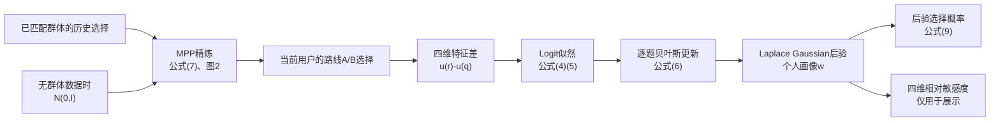

# FAVOUR 四维实现与数据流程

## 1. 实现边界

核心学习流程按 FAVOUR 论文的公式（4）至（9）、图 1 和图 2 实现。
为了得到当前任务要求的画像，路线特征只保留时间、费用、步行距离和
换乘次数四维，而不是论文实验中的 59 维。

论文没有公布“基本信息→用户群体”的具体分类器和数据，所以代码不虚构
这一规则。调用方完成群体匹配后，将该群体的历史路线选择传入
`group_histories`，代码再按论文公式（7）得到 MPP。

## 2. 整体流程



实际调用顺序：

```text
PairwisePreferenceWeightLearner.fit()
├─ NormalizedCostFeatureExtractor.extract_comparison()
├─ MassPreferencePriorEstimator.refine()       # 有群体历史时
│  ├─ FavourLaplaceInference.infer()
│  └─ MassPreferencePriorEstimator.aggregate()
├─ FavourLaplaceInference.update_incrementally()
│  └─ FavourLaplaceInference.infer()
│     ├─ FavourPosteriorObjective.evaluate()
│     └─ BoxBoundedTrustRegionOptimizer.optimize()
└─ FavourPosteriorPredictor.probability()
```

## 3. 公式与代码对应

### 3.1 四维路线特征

当前特征向量为：

$$
u(r)=[time,cost,walking,transfers]^T.
$$

四项单位不同，`normalization.py` 先用固定业务尺度转换。这些尺度是四维
应用的基函数参数，不是 FAVOUR 论文给出的常数。

```python
def _normalize(route: RouteAttributes) -> Vector:
    return tuple(
        min(route.value_for(dimension) / NORMALIZATION_SCALES[dimension], 1.0)
        for dimension in PREFERENCE_DIMENSIONS
    )
```

用户选择 $r_t$ 、拒绝 $q_t$ 后，`FeatureComparison` 直接计算论文中的效用特征差：

$$
d_t=u(r_t)-u(q_t).
$$

```python
def utility_difference(self) -> Vector:
    return tuple(
        chosen - rejected
        for chosen, rejected in zip(self.chosen, self.rejected, strict=True)
    )
```

### 3.2 公式（4）（5）：成对选择概率

论文公式（4）：

$$
P(r_t\succ q_t\mid w)
=\frac{1}{1+e^{U(q_t)-U(r_t)}}
=\sigma(w^Td_t).
$$

多次选择按公式（5）相乘：

$$
p(T\mid w)=\prod_tP(r_t\succ q_t\mid w).
$$

`inference.py` 使用与连乘等价的负对数求和，避免小概率下溢：

```python
difference = observation.utility_difference()
terms = self._likelihood.evaluate(dot(coefficients, difference))
value += terms.negative_log_likelihood
```

```python
negative_log_likelihood = softplus(-margin)  # -log(sigmoid(wᵀd))
```

这里 `coefficients` 就是论文的 $w$，没有改换为另一套正数系数。时间、费用、
步行和换乘都是代价，因此其后验均值按论文要求约束为非正数。

### 3.3 Gaussian 后验与 Laplace 近似

给定当前 Gaussian 先验 $N(\mu,\Sigma)$，代码最小化负对数后验：

$$
J(w)=\frac12(w-\mu)^T\Sigma^{-1}(w-\mu)
+\sum_t\log(1+e^{-w^Td_t}).
$$

```python
centered = tuple(current - prior for current, prior in zip(
    coefficients, self._prior_mean, strict=True
))
value = 0.5 * quadratic_form(centered, self._precision)
```

负对数后验的解析梯度和 Hessian 用于论文指定的 box-bounded trust-region 求解。
优化器按论文实验设置使用 5 个均匀随机起点，随机种子为 1。

$$
\tilde w=\arg\max_w p(T\mid w)p(w),
\qquad
\tilde\Sigma=(-H)^{-1}.
$$

代码最小化负对数后验，所以其 Hessian 是 $-H$：

```python
optimized = self._optimizer.optimize(
    objective.evaluate,
    prior.lower_bound_vector(),
    prior.upper_bound_vector(),
)
covariance = inverse_matrix(optimized.evaluation.hessian)
```

### 3.4 公式（6）：逐题更新个人画像

$$
p(w\mid T^i)=\frac{p(T^i\mid w)p(w\mid T^{i-1})}{p(T^i)}.
$$

`update_incrementally()` 每次只加入一条选择，并把该次 Gaussian 后验作为
下一题的先验：

```python
posterior = prior
for observation in observations:
    posterior, step_converged = self.infer((observation,), posterior)
```

### 3.5 公式（7）与图 2：群体 MPP

无群体历史数据时，按图 2 从 $N(0,I)$ 开始。有已匹配群体的 $K$ 个历史用户
后验 $N(\mu_k,\Sigma_k)$ 时，按公式（7）聚合：

$$
\bar\mu=\frac1K\sum_{k=1}^{K}\mu_k,
$$

$$
\bar\Sigma=\frac1K\sum_{k=1}^{K}
\left((\mu_k-\bar\mu)(\mu_k-\bar\mu)^T+\Sigma_k\right).
$$

```python
mean = tuple(
    sum(vector[index] for vector in vectors) / count
    for index in range(size)
)
covariance = tuple(
    tuple(
        sum(
            posterior.covariance[row][column]
            + (vector[row] - mean[row]) * (vector[column] - mean[column])
            for posterior, vector in zip(posteriors, vectors, strict=True)
        ) / count
        for column in range(size)
    )
    for row in range(size)
)
```

实现按图 2 反复更新历史用户模型、重新聚合 MPP，直到相邻两次 MPP 的
KL 散度小于阈值。

### 3.6 公式（9）：后验选择概率

$$
P(r\succ q\mid T)\approx\sigma(\lambda\tilde w^Td),
\qquad
\lambda=(1+\pi d^T\tilde\Sigma d/8)^{-1/2}.
$$

```python
difference = observation.utility_difference()
variance = max(0.0, quadratic_form(difference, posterior.covariance))
attenuation = 1.0 / sqrt(1.0 + pi * variance / 8.0)
return sigmoid(attenuation * dot(posterior.mean_vector(), difference))
```

### 3.7 四维展示画像

`result.utility_coefficients` 是论文模型实际使用的 $w$。为了用百分比展示“对某项代价
有多敏感”，`result.weights` 只在输出时计算：

$$
weight_j=\frac{\max(0,-\tilde w_j)}{\sum_l\max(0,-\tilde w_l)}.
$$

这个百分比不会回写或替换论文的效用系数。

## 4. 每个 Python 文件的作用

| 文件 | 必要职责 | 接收/输出 |
|---|---|---|
| `models.py` | 定义路线、成对选择、Gaussian 模型和结果 | 贯穿全流程的数据对象 |
| `normalization.py` | 把原始四项属性转成同一尺度 | `PairwisePreference` → `FeatureComparison` |
| `inference.py` | 实现公式（4）—（9）中的概率与贝叶斯推断 | 特征比较+先验 → 后验/MPP/概率 |
| `optimization.py` | 实现论文指定的箱约束 trust-region 和所需四维矩阵运算 | 后验目标 → 后验众数 |
| `learner.py` | 组合图 1、图 2 和公式（9），形成唯一学习入口 | 路线选择+群体历史 → 四维结果 |
| `exceptions.py` | 区分输入错误与数值求解错误 | 异常类型 |
| `__init__.py` | 集中导出模块对外类型 | 统一导入入口 |

`service.py`、`priors.py`、仓库协议、适配器和未使用的配置层均不在上述计算链中，
已删除。

## 5. 最小调用方式

```python
learner = PairwisePreferenceWeightLearner()
result = learner.fit(
    comparisons=current_user_choices,
    group_histories=matched_group_histories,
)

result.utility_coefficients  # 论文效用系数 w
result.posterior.covariance  # Laplace 后验协方差
result.weights               # 四维展示百分比
result.choice_probabilities  # 公式（9）的选择概率
```

没有群体历史时省略 `group_histories`，学习器会按图 2 使用 $N(0,I)$ 初值。

## 6. 验证范围

```bash
PYTHONDONTWRITEBYTECODE=1 python3 -m unittest discover -s tests -v
PYTHONDONTWRITEBYTECODE=1 python3 examples/interactive_profile_demo.py
```

测试覆盖公式（4）的 Logit 概率、解析梯度、公式（7）的 MPP 聚合、公式（9）的预测、
trust-region 求解、公式（6）的逐题更新、四个画像维度识别、群体历史作用和交互流程。
