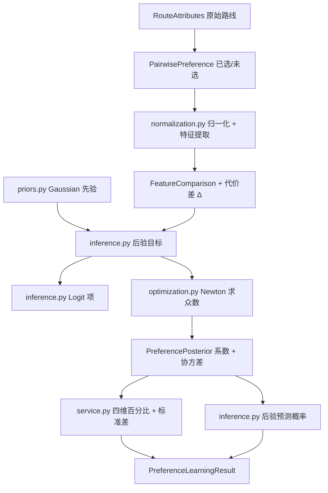
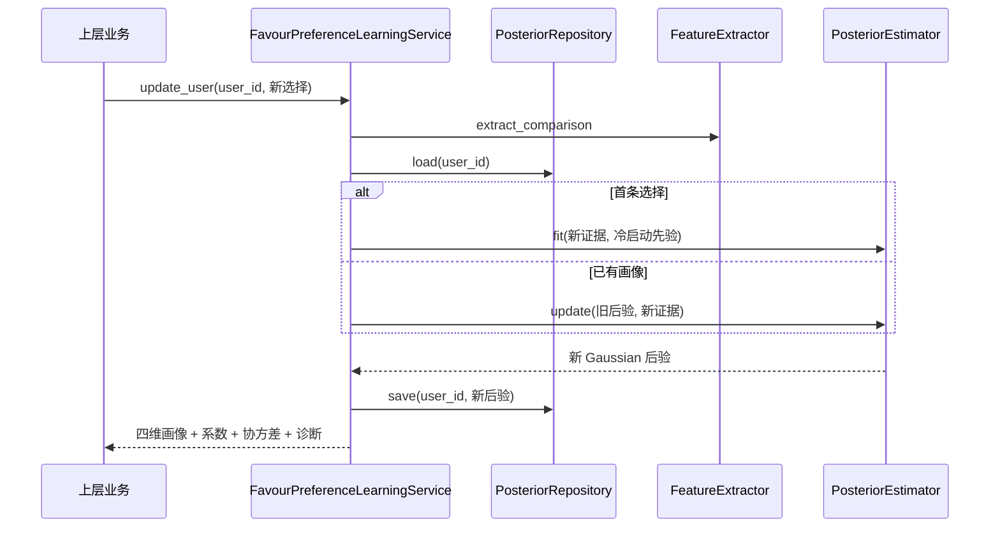
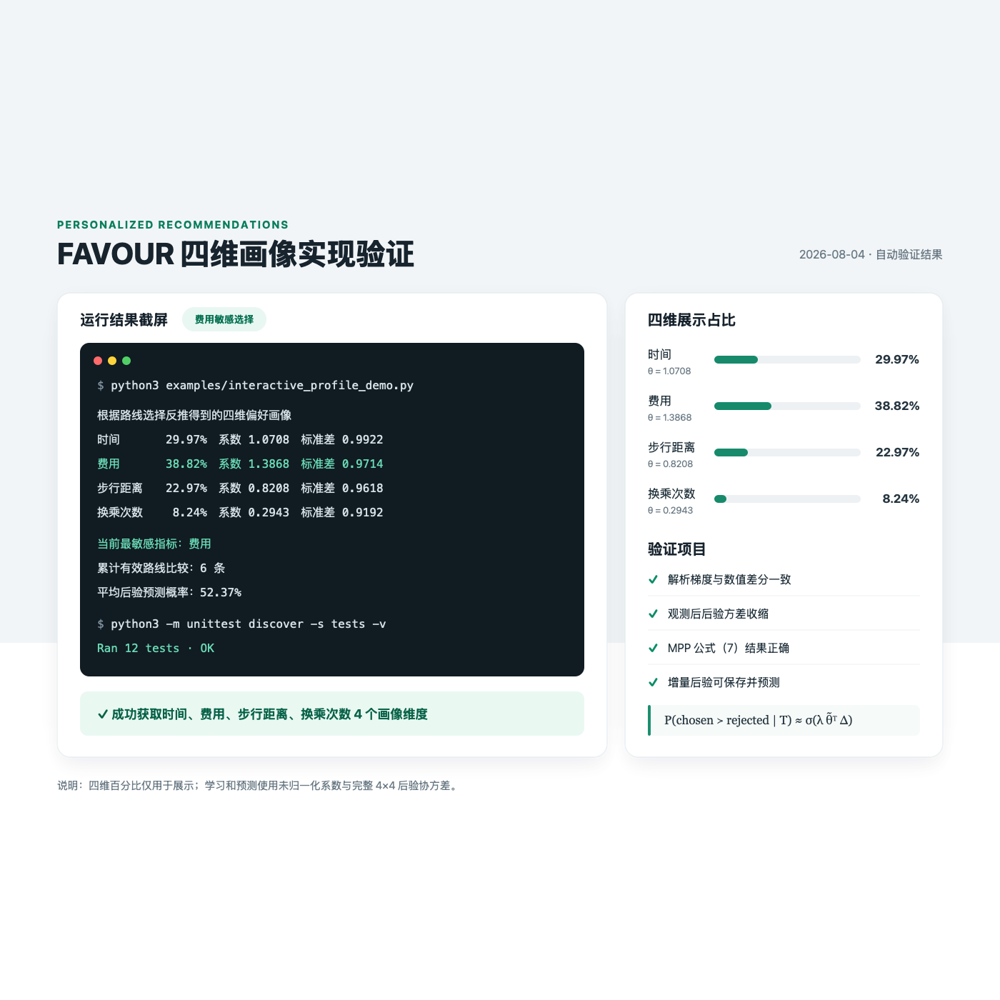

# FAVOUR 四维画像实现与模块交互说明

## 1. 实现结论

当前模块已经把原来的“单纯形权重 + 投影梯度下降”替换为 FAVOUR 的核心
概率学习流程：Gaussian 先验、Bradley-Terry/Logit 成对选择似然、Laplace
Gaussian 后验、增量 Bayes 更新、MPP 聚合和带后验不确定性的选择预测。

项目当前只取四项可解释的路线代价特征：

1. 总时间 `time`；
2. 总费用 `cost`；
3. 步行距离 `walking_distance`；
4. 换乘次数 `transfers`。

因此它是“FAVOUR 推断方法 + 四维缩减特征”，不是论文全部 59 个特征的复刻。
这四个维度会同时出现在模型系数、后验协方差、后验标准差和展示百分比中。

## 2. 论文公式与代码公式

### 2.1 特征归一化

四种属性单位不同，先用固定、可版本化的业务尺度归一化：

$$
z_j(r)=\min\left(\frac{x_j(r)}{s_j},1\right).
$$

默认尺度为 180 分钟、100 元、3000 米、4 次。它们是工程初值，不是 FAVOUR
论文给出的常数；生产模型应使用路线数据的稳定分位数重新标定并发布新版本。

### 2.2 公式（4）（5）：成对 Logit 似然

FAVOUR 对用户选择路线 $r$ 而非 $q$ 定义：

$$
P(r\succ q\mid w)=\sigma\left(U(r)-U(q)\right).
$$

论文的 $w$ 是效用系数。对于时间、费用等代价，合理系数通常为负。项目为了让
画像更容易理解，定义正向代价敏感系数：

$$
\theta=-w,\qquad
\Delta=z(q)-z(r)=z_{rejected}-z_{chosen}.
$$

于是：

$$
w^T(z(r)-z(q))=\theta^T\Delta,
$$

项目中的选择概率为：

$$
p_t=P(chosen_t\succ rejected_t\mid\theta)
=\sigma(\theta^T\Delta_t).
$$

这不是对论文模型的近似改写，而是同一个 Logit 指数的符号等价变换。多次选择
在给定个人系数后条件独立，似然对应论文公式（5）：

$$
p(T\mid\theta)=\prod_t p_t^{\alpha_t},
$$

其中 $\alpha_t$ 是可选的证据权重。

### 2.3 Gaussian 先验、后验众数和 Laplace 近似

冷启动先验定义为：

$$
\theta\sim\mathcal N(\mu_0,\Sigma_0).
$$

代码实际最小化负对数后验：

$$
J(\theta)=
\frac12(\theta-\mu_0)^T\Sigma_0^{-1}(\theta-\mu_0)
+\sum_t\alpha_t\log\left(1+e^{-\theta^T\Delta_t}\right).
$$

解析梯度和 Hessian 分别为：

$$
\nabla J=
\Sigma_0^{-1}(\theta-\mu_0)
+\sum_t\alpha_t(p_t-1)\Delta_t,
$$

$$
\nabla^2J=
\Sigma_0^{-1}
+\sum_t\alpha_t p_t(1-p_t)\Delta_t\Delta_t^T.
$$

后验众数和 Laplace 协方差为：

$$
\tilde\theta=\arg\min_\theta J(\theta),\qquad
\tilde\Sigma=\left(\nabla^2J(\tilde\theta)\right)^{-1}.
$$

论文采用 box-bounded 后验众数优化。当前默认边界是
$0\leq\theta_j\leq20$，上界可配置。求解器使用阻尼 Newton、解析 Hessian、
箱型投影和 Armijo 回溯线搜索。

### 2.4 公式（6）：增量 Bayes 更新

每得到一条新选择，把上一次 Gaussian 后验直接作为下一次 Gaussian 先验：

$$
p(\theta\mid T^i)\propto
p(t_i\mid\theta)\,p(\theta\mid T^{i-1}).
$$

`FavourPreferenceLearningService.update_user` 从仓库读取上次后验，调用
`FavourLaplacePosteriorEstimator.update`，再保存新后验。仓库接口可替换；当前
提供的 `InMemoryPosteriorRepository` 只适合演示和单元测试。

### 2.5 公式（7）：群体偏好先验 MPP

对同一用户类别的 $K$ 个个人 Gaussian 后验，MPP 估计为：

$$
\bar\mu=\frac1K\sum_{k=1}^{K}\mu_k,
$$

$$
\bar\Sigma=\frac1K\sum_{k=1}^{K}
\left[(\mu_k-\bar\mu)(\mu_k-\bar\mu)^T+\Sigma_k\right].
$$

`MassPreferencePriorEstimator` 已实现该公式，并给协方差对角线增加很小的数值
正则。当前交互示例没有真实的多用户分类数据，因此仍使用固定等权 Gaussian
先验；不能把固定先验描述成“已经从人群数据学出的 MPP”。

### 2.6 公式（8）（9）：考虑不确定性的后验预测

对待比较路线的代价差 $\Delta$，项目使用与论文公式（9）相同的
Gaussian-Logit 近似：

$$
\lambda=
\left(1+\frac{\pi\Delta^T\tilde\Sigma\Delta}{8}\right)^{-1/2},
$$

$$
P(chosen\succ rejected\mid T)
\approx\sigma\left(\lambda\tilde\theta^T\Delta\right).
$$

当后验在该路线差方向上仍很不确定时，$\lambda$ 会把概率拉向 0.5。这比只用
后验均值计算 Sigmoid 更符合 FAVOUR，也能区分“系数相似但不确定性不同”的
两个用户画像。

## 3. 为什么模型系数不再强制总和为 1

FAVOUR 的 Gaussian 系数决定 Logit 的尺度。若强制
$\sum_j\theta_j=1$，在归一化特征差不超过 1 时，最大 margin 会被人为限制，
模型很难表达非常稳定的选择。当前分为两层：

- `result.coefficients`：模型真实使用的四个非负敏感度，不要求和为 1；
- `result.weights`：仅供界面显示的相对画像，按系数总和归一化，和为 100%。

路线选择预测、增量学习和后验协方差始终使用 `coefficients`，不能用展示百分比
替换模型系数。

## 4. 每个 Python 文件的功能

| 文件 | 单一职责 | 主要输入 | 主要输出/调用对象 |
|---|---|---|---|
| `__init__.py` | 汇总模块稳定公开接口 | 各子模块公开类型 | 供示例、测试和上层业务导入 |
| `exceptions.py` | 定义领域、校验、数值和状态异常 | 错误场景 | `ProfileValidationError` 等 |
| `models.py` | 定义不可变领域值对象和四维顺序 | 路线、选择、先验、后验数据 | `PairwisePreference`、`PreferencePosterior` 等 |
| `normalization.py` | 归一化路线属性并提取版本化四维特征 | 路线和成对选择 | `FeatureComparison` |
| `optimization.py` | 提供四维矩阵运算和箱约束 Newton 求解 | 目标函数、初值、边界 | 众数、目标值、梯度、Hessian、收敛状态 |
| `inference.py` | 实现 Logit 似然、Laplace 后验和公式（9）预测 | 特征证据、Gaussian 先验 | 后验和选择概率 |
| `priors.py` | 提供固定先验、旧先验适配和公式（7）MPP | 旧权重或多个个人后验 | `GaussianPreferencePrior` |
| `service.py` | 定义组件协议，编排学习/预测，并提供展示和内存仓库 | 各接口实现、路线选择 | 完整学习结果或选择概率 |
| `learner.py` | 装配默认 FAVOUR 组件并提供简洁入口 | 比较证据、旧/新先验 | `PreferenceLearningResult` 或应用服务 |

## 5. 文件之间如何交互数据

### 5.1 批量学习流程



具体步骤：

1. 上游用 `RouteAttributes` 构造两条路线，并记录用户选择为
   `PairwisePreference(chosen, rejected)`；
2. `service.py` 让 `normalization.py` 归一化并提取版本化四维特征；
3. `FeatureComparison.cost_difference()` 生成 $\Delta=rejected-chosen$；
4. `inference.py` 从先验精度、Logit 似然构造目标、解析梯度和 Hessian；
5. `optimization.py` 求后验众数，Hessian 的逆成为 Laplace 协方差；
6. `service.py` 的展示组件生成四维百分比和四个后验标准差；
7. `inference.py` 对已观察选择计算平均后验预测概率，形成诊断信息；
8. `service.py` 返回包含 `weights`、`coefficients`、`posterior`、`diagnostics`
   的完整结果。

### 5.2 单用户增量流程



`feature_schema_version` 随先验和后验一起保存。若线上特征版本不同，代码会拒绝
混用，避免把不同含义的四维系数直接累积。

## 6. SOLID 对应关系

- 单一职责：归一化、似然、推断、预测、展示和存储仍由不同类负责；
- 开闭原则：新增特征提取器、先验来源或数据库仓库时，无需修改推断公式；
- 里氏替换：应用服务只依赖 `service.py` 中的行为协议；
- 接口隔离：每个 Protocol 只包含当前用例真正需要的方法；
- 依赖倒置：`service.py` 依赖抽象接口，`learner.py` 负责装配默认实现。

## 7. 调用方式

### 7.1 兼容原来的批量学习

```python
learner = PairwisePreferenceWeightLearner()
result = learner.fit(comparisons, GroupPreferencePrior.uniform())

result.weights       # 四维展示百分比，总和为 1
result.coefficients  # 四维模型系数，不要求总和为 1
result.posterior     # 系数、4×4 协方差、版本和证据数
result.diagnostics   # 收敛、预测概率、标准差等
```

### 7.2 增量更新和预测

```python
repository = InMemoryPosteriorRepository()
service = PairwisePreferenceWeightLearner().create_service(
    GroupPreferencePrior.uniform(),
    repository,
)

updated = service.update_user("user-001", comparison)
probability = service.predict_user_choice("user-001", future_comparison)
```

生产环境应实现 `PosteriorRepository` 并持久化完整后验，而不是只保存四个展示
百分比。

## 8. 已完成的合理性验证

`tests/profile/test_favour_core.py` 覆盖：

- Sigmoid 正反 margin 的概率和为 1；
- 负对数后验的解析梯度与中心数值差分一致；
- 加入有效选择后，观测方向上的后验方差小于先验方差；
- 公式（7）的 MPP 均值、协方差和证据数计算正确；
- 公式（9）的预测概率与手工计算结果一致；
- 无个人证据时返回四维等权展示画像；
- 费用敏感选择能使费用成为最高画像维度；
- 分别输入时间、费用、步行、换乘的单维稳定证据时，四个维度都能被单独识别；
- 模型系数不再受“总和等于 1”的错误限制；
- 强一致证据的 Logit 概率可超过单纯形模型造成的尺度上限；
- 增量更新会累计证据、持久化后验并可预测新选择；
- 终端示例确实输出时间、费用、步行距离、换乘次数四个画像维度。

运行命令：

```bash
python3 -m unittest discover -s tests -v
python3 -m compileall -q src tests examples
python3 examples/interactive_profile_demo.py
```

费用敏感选择的四维输出与自动测试截屏：



## 9. 当前边界与下一步

当前数学闭环是合理且可验证的，但以下内容仍需要真实数据后才能声称完成：

- 默认归一化尺度尚未用真实路线分布标定；
- 固定 Gaussian 冷启动先验不是由真实用户群体学出的 MPP；
- 尚未实现论文完整的交通方式、天气交互和细粒度路线特征；
- `InMemoryPosteriorRepository` 重启后会丢失，生产环境需要数据库实现；
- 现有 6 道题只够形成初始画像，不能代表已达到论文实验中的预测精度；
- 模块只学习和预测偏好，尚未负责候选路线生成与最终路线排序。

因此，当前可以准确表述为：**FAVOUR 的核心公式和增量推断流程已经落地，并能
输出四维用户画像；真实精度、归一化尺度和群体 MPP 仍需用正式数据校准。**
